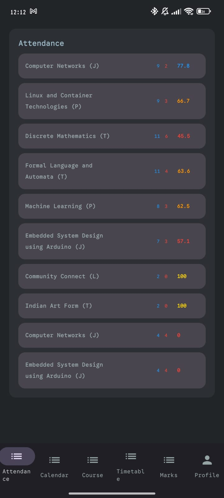
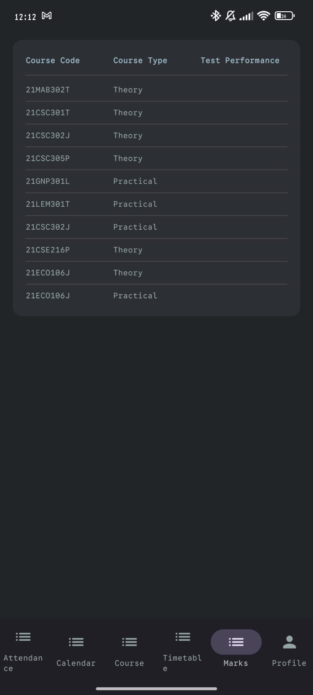
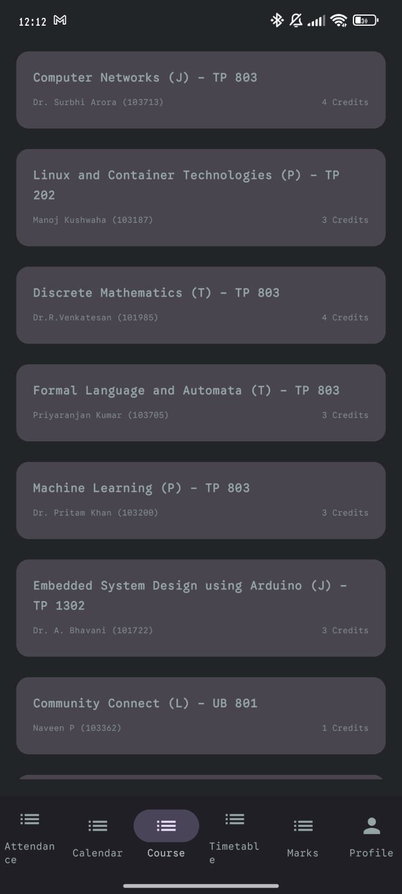
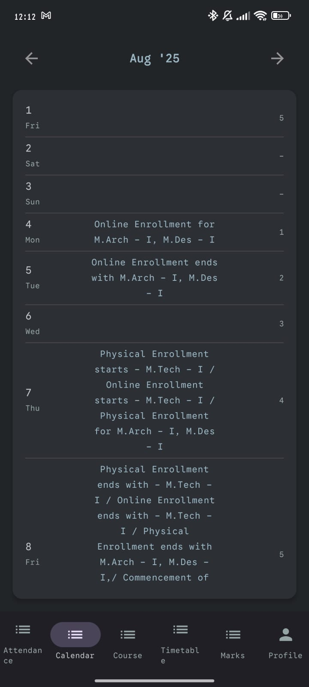
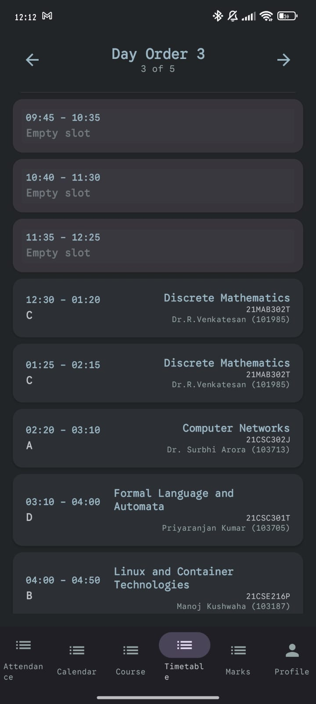

<p align="center">
  
  <h1 align="center">Vihla: An Academia Wrapper</h1>
</p>

A lightweight native Android wrapper for Academia.edu, built with Kotlin to deliver a faster, cleaner mobile experience while preserving all academic functionality.  

## ✨ Features

- 🚀 Native Android interface optimized for Academia.edu
- 📱 Mobile-first design with smooth navigation
- 🎨 Material You dynamic theming
- 🌙 Dark mode support
- 🔒 Secure authentication with token refresh
- 🔔 Notification system
- 🔄 Background sync

## 📸 Screenshots

<div align="center">
    
    
    
    
    
</div>

## 📋 Requirements

- Android 9.0 (API 28) or higher
- Active Academia account
- Internet connection

## ⬇️ Installation

### From Releases
1. Download the latest APK from [Releases](https://github.com/veradec/vihla/releases)
2. Enable "Install unknown apps" for your browser/file manager
3. Install the downloaded APK

### From Source
```bash
git clone https://github.com/veradec/vihla.git
cd vihla
./gradlew assembleDebug
```

## 🙏 Acknowledgements

This project is a Kotlin rewrite of the original [SRM Academia API](https://github.com/jackwaghan/srm-academia-api) by [Jack Waghan](https://github.com/jackwaghan). 

Key improvements in this version include:
- Complete Kotlin implementation
- Modern Android architecture components
- Enhanced error handling
- Improved performance
- Additional features specific to mobile usage

We're grateful for the foundational work done on the original project that made this implementation possible.
